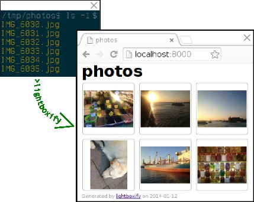

# Lightboxify

Lightboxify turns a folder containing images into a lightbox slideshow with a single command.

## Demo and instructions

Grab a copy of lightboxify from Github.

    git clone https://github.com/sepastian/lightboxify

Select a folder containing images to turn into a slideshow and 
where run lightboxify.

    cd lightboxify
    ./lightboxify -s /my/image/folder

Lightboxify will generate thumbnails in `/my/image/folder/thumbs`, download
[lightbox2](http://lokeshdhakar.com/projects/lightbox2/) into `/my/image/folder/lightbox`, generate `/my/image/folder/css/lightboxify.css`
and generate `/my/image/folder/index.html`.

Start a web server, for example Pythons built-in `SimpleHTTPServer`, and
point your browser to the newly generated slideshow.

    cd /my/image/folder
    python -m SimpleHTTPServer

`SimpleHTTPServer` will be listening at `localhost:8000`, point your browser there.
Or, publish the slideshow copying the folder to your web server.

    scp -r /my/image/folder/ user@webserver.com:/var/www/www.mywebsite.com/

View the slideshow online pointing your browser at `www.mywebsite.com/folder`
(depending on how you have configured your web server).

If you like *lightboxify* a lot or, for some reason have to use it a lot,
you may like to add the script to your search path. Assuming that your `$PATH`
contains `/usr/local/bin`, you can do the following to run *lightboxify* from
everywhere.

    cd lightboxify
    sudo cp lightboxify /usr/local/bin

## Options

Run `lightboxify -h` for help.

### Source folder

Per default, `lightboxify` will convert all images in the present working directory "." into
a slideshow. To use a different directory, supply `-s`, for example `-s /tmp/my/images`.

### Thumbnail dimensions

The default size for thumbnails is 100px a side. To specify a different side length,
supply a value for the `-d` option, for example `-d 150` for thumbnails which are 150x150 pixels wide.

## Dependencies

*Lightboxify* has been developed and tested on Debian Linux, with the following
dependencies installed.

  * Curl
  * Imagemagick

## Credits and license

### Author
By Sebastian Gassner,
backed by Lokesh Dhakar's awesome
[Lightbox2](https://github.com/lokesh/lightbox2).

### License
Licensed under the [Creative Commons Attribution 2.5 License](http://creativecommons.org/licenses/by/2.5/)

* Free for use in both personal and commercial projects.
* Attribution requires leaving author name, author homepage link, and the license info intact.
